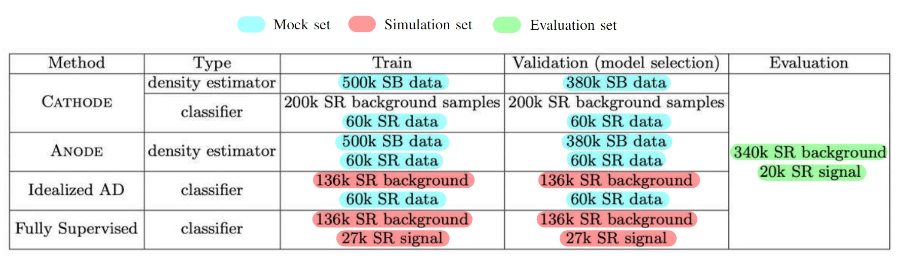

Для получения данных:

```
python data/prepare_data_csv.py
```

Последний столбец -- '5' -- маркер сигнала/фона.

|            | shape       |   signal fracture |   num signals |
|:-----------|:------------|------------------:|--------------:|
| evaluation | (360000, 6) |       0.0555556   |         20000 |
| mock       | (998876, 6) |       0.000993116 |           992 |
| simulation | (327385, 6) |       0.166553    |         54527 |

Распределение наборов данных по моделям представлено в следующей таблице:


